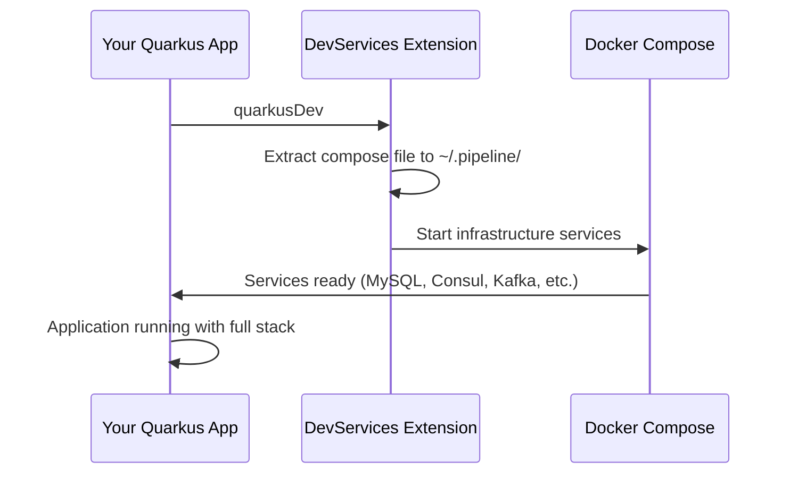
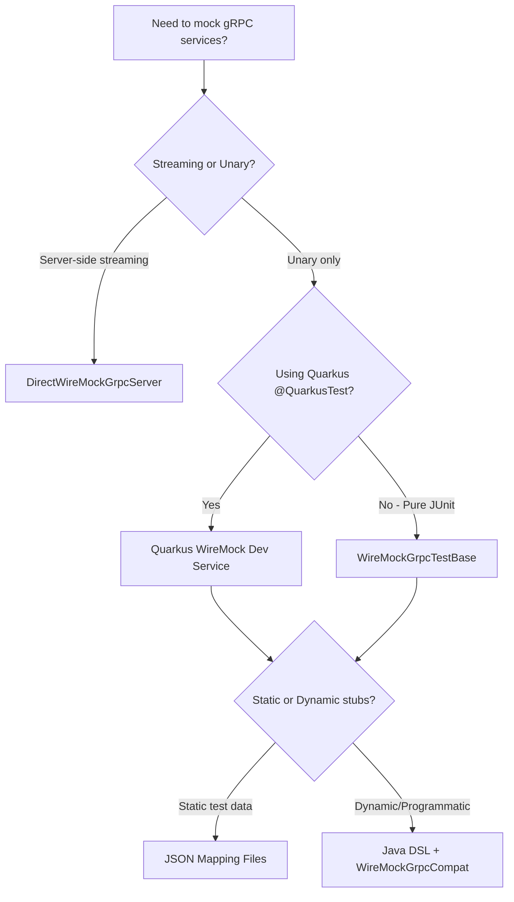

# Pipestream AI Platform Libraries

<div align="center">

**Foundational libraries, gRPC contracts, development tooling, and testing infrastructure for the Pipestream AI platform**

[](https://opensource.org/licenses/MIT)
[](https://adoptium.net/)
[](https://quarkus.io/)
[](https://grpc.io/)

</div>

---

## Table of Contents

- [Overview](#overview)
- [Repository Structure](#repository-structure)
- [Getting Started](#getting-started)
  - [Prerequisites](#prerequisites)
  - [Building the Project](#building-the-project)
  - [Publishing Artifacts](#publishing-artifacts)
- [Modules](#modules)
  - [BOM (Bill of Materials)](#bom-bill-of-materials)
  - [DevServices](#devservices)
  - [gRPC Stubs](#grpc-stubs)
  - [Libraries](#libraries)
- [Usage Examples](#usage-examples)
  - [Using the BOM](#using-the-bom)
  - [Dynamic gRPC Clients](#dynamic-grpc-clients)
  - [Testing with WireMock](#testing-with-wiremock)
  - [Development Services](#development-services)
- [Building and Publishing](#building-and-publishing)
- [Contributing](#contributing)
- [License](#license)

---

## Overview

The **platform-libraries** repository provides the foundational infrastructure for the Pipestream AI platform, a distributed system for document processing, search, and AI-powered workflows. This repository is organized into four main module groups:

- **BOM** - Centralized dependency version management
- **DevServices** - Development-time infrastructure automation
- **gRPC** - Protocol Buffer definitions and generated stubs
- **Libraries** - Shared utilities, clients, and testing frameworks

All modules are published to Maven Central as a coordinated release train using semantic versioning derived from git tags.

---

## Repository Structure

```
platform-libraries/
├── bom/                          # Bill of Materials for dependency management
│   ├── build.gradle             # BOM and version catalog publishing
│   └── README.md                # BOM documentation
│
├── devservices/                 # Quarkus development services extension
│   ├── devservices/             # Runtime module
│   ├── devservices-deployment/  # Build-time deployment module
│   ├── compose-devservices.yml  # Docker Compose infrastructure
│   └── README.md                # DevServices guide
│
├── grpc/                        # gRPC stubs and descriptors
│   ├── grpc-stubs/              # Java gRPC stubs (Quarkus-based)
│   ├── grpc-google-descriptor/  # Descriptor with Google well-known types
│   ├── node/                    # TypeScript/JavaScript stubs (Connect-ES)
│   └── README.md                # gRPC overview
│
├── libraries/                   # Shared platform libraries
│   ├── pipeline-api/            # Core API types and interfaces
│   ├── pipeline-commons/        # Common utilities
│   ├── dynamic-grpc/            # Dynamic gRPC client management
│   ├── dynamic-grpc-registration-clients/  # Registration clients
│   ├── data-util/               # Test data utilities
│   ├── grpc-wiremock/           # gRPC testing framework
│   └── README.md                # Libraries guide
│
├── gradle/
│   └── libs.versions.toml       # Version catalog (50+ dependencies)
│
├── scripts/
│   └── regenerate-stubs.sh      # gRPC stub regeneration script
│
├── build.gradle                 # Root build configuration
├── settings.gradle              # Multi-module setup
└── README.md                    # This file
```

---

## Getting Started

### Prerequisites

- **Java 21+** (OpenJDK or Oracle JDK)
- **Gradle** (uses Gradle wrapper, no installation required)
- **Git** (for cloning and version management)
- **Docker** (optional, for development services)

### Building the Project

Clone the repository and build all modules:

```bash
# Clone the repository
git clone https://github.com/ai-pipestream/platform-libraries.git
cd platform-libraries

# Build all modules
./gradlew build
```

The build produces:
- JAR files for all modules
- Sources JARs for IDE navigation
- Javadoc JARs for API documentation

**Example output:**
```
bom/build/libs/
  └── pipeline-bom-0.1.2.jar

grpc/grpc-stubs/build/libs/
  ├── grpc-stubs-0.1.2.jar
  ├── grpc-stubs-0.1.2-sources.jar
  └── grpc-stubs-0.1.2-javadoc.jar

libraries/pipeline-api/build/libs/
  ├── pipeline-api-0.1.2.jar
  ├── pipeline-api-0.1.2-sources.jar
  └── pipeline-api-0.1.2-javadoc.jar
```

### Publishing Artifacts

**Publish to Maven Local:**
```bash
# Publish all modules to ~/.m2/repository
./gradlew publishAllToMavenLocal
```

**Publish to Maven Central:**
```bash
# Create a git tag and push
git tag v0.1.3
git push origin v0.1.3

# GitHub Actions will automatically publish to Maven Central
```

---

## Modules

### BOM (Bill of Materials)

Centralized dependency version management for the entire Pipestream AI platform.

**Published Artifacts:**
- `ai.pipestream:pipeline-bom` - Maven BOM
- `ai.pipestream:pipeline-bom-catalog` - Gradle version catalog

**Key Features:**
- Manages versions for Quarkus (3.29.2), gRPC (1.76.0), Protobuf (4.33.0)
- Coordinates 50+ dependencies across the platform
- Enforces strict versioning for critical components
- Provides both Maven BOM and Gradle version catalog

**Usage in your project:**

```gradle
// build.gradle
dependencies {
    // Import the BOM
    implementation platform('ai.pipestream:pipeline-bom:0.1.2')

    // Dependencies without versions (managed by BOM)
    implementation 'io.quarkus:quarkus-grpc'
    implementation 'io.grpc:grpc-stub'
}
```

> **Note:** The BOM uses a Quarkus-first versioning strategy with strict overrides for gRPC and Protobuf to ensure compatibility.

**JavaDoc:** [`ai.pipestream.bom`](https://javadoc.io/doc/ai.pipestream/pipeline-bom)

📖 [Read full BOM documentation](bom/README.md)

---

### DevServices

Development-time infrastructure automation for Quarkus microservices.

**Published Artifact:** `ai.pipestream:quarkus-pipeline-devservices`

**Provides:**
- MySQL database (port 3306)
- Consul service discovery (ports 8500, 8600)
- Kafka message broker (ports 9092, 9094)
- Apicurio Schema Registry (ports 8081, 8888)
- OpenSearch search engine (ports 9200, 5601)
- MinIO object storage (ports 9000, 9001)
- Redis cache (port 6379)
- LGTM observability stack (ports 3001, 4317, 4318)

**How it works:**
1. Add dependency to your Quarkus project
2. Extension extracts Docker Compose file to `~/.pipeline/compose-devservices.yml`
3. Configure Quarkus Compose Dev Services in `application.properties`
4. Run `./gradlew quarkusDev` - infrastructure starts automatically

**Usage example:**

```gradle
// build.gradle
dependencies {
    implementation 'ai.pipestream:quarkus-pipeline-devservices:0.1.2'
}
```

```properties
# application.properties
%dev.quarkus.compose.devservices.enabled=true
%dev.quarkus.compose.devservices.files=${user.home}/.pipeline/compose-devservices.yml
%dev.quarkus.compose.devservices.project-name=pipeline-shared-devservices
%dev.quarkus.datasource.devservices.enabled=false
```

```bash
# Start development mode
./gradlew quarkusDev
```

> **Development Tip:** Multiple applications can share the same infrastructure. Use `stop-services=false` to keep services running between application restarts.

**Architecture:**



**JavaDoc:** [`ai.pipestream.devservices`](https://javadoc.io/doc/ai.pipestream/quarkus-pipeline-devservices)

📖 [Read full DevServices documentation](devservices/README.md)

---

### gRPC Stubs

Protocol Buffer definitions and generated gRPC code for all platform services.

**Modules:**
- **grpc-stubs** - Java stubs with Quarkus/Mutiny support
- **grpc-google-descriptor** - Descriptor with Google well-known types
- **node** - TypeScript/JavaScript stubs for Connect-ES

**Published Artifacts:**
- `ai.pipestream:grpc-stubs` (Java)
- `ai.pipestream:grpc-google-descriptor` (Java)
- `@ai-pipestream/grpc-stubs` (npm)

**Services included (50+ proto files):**

| Category | Services |
|----------|----------|
| **Core** | PipelineConfigService, RepositoryService, EngineService |
| **Modules** | ModuleService, ConnectorIntakeService, DocumentUploadService, TestingHarness |
| **Repository** | AccountService, FilesystemService, CrawlerService, PipeDocService, GraphService |
| **OpenSearch** | OpenSearchManager, SchemaManager, IngestionService |
| **Platform** | PlatformRegistration, ValidationService, HealthCheck |
| **Tika Metadata** | Email, PDF, Office, HTML, Image, Font, Media metadata types (15+ files) |

**Usage example (Java):**

```gradle
// build.gradle
dependencies {
    implementation 'ai.pipestream:grpc-stubs:0.1.2'
}
```

```java
package ai.pipestream.example;

import ai.pipestream.platform.registration.*;
import io.quarkus.grpc.GrpcClient;

import jakarta.inject.Inject;

/**
 * Example service demonstrating gRPC client injection.
 *
 * @see ai.pipestream.platform.registration.PlatformRegistration
 */
public class RegistrationExample {

    @Inject
    @GrpcClient("platform-registration")
    PlatformRegistration client;

    /**
     * Lists all registered services in the platform.
     *
     * @return A list of registered services with their metadata
     */
    public Uni<ListServicesResponse> listServices() {
        return client.listServices(ListServicesRequest.newBuilder().build());
    }
}
```

> **Code Annotation:** This example uses Quarkus gRPC's `@GrpcClient` annotation for dependency injection. The client name "platform-registration" must match a configured gRPC channel in `application.properties`.

**Regenerating stubs:**

```bash
# Regenerate both Java and TypeScript stubs
./scripts/regenerate-stubs.sh
```

> **Note:** The script automatically builds the descriptor, generates stubs, and publishes an alpha npm version with a timestamp.

**JavaDoc:**
- [`ai.pipestream.grpc`](https://javadoc.io/doc/ai.pipestream/grpc-stubs) (Java stubs)
- [TypeDoc](https://www.npmjs.com/package/@ai-pipestream/grpc-stubs) (TypeScript stubs)

📖 [Read full gRPC documentation](grpc/README.md)

---

### Libraries

Shared utilities, clients, and testing frameworks used across all services.

#### pipeline-api

Core API contracts, annotations, and events for platform integration.

**Published Artifact:** `ai.pipestream:pipeline-api`

**Key Components:**

| Component | Description |
|-----------|-------------|
| **Annotations** | `@GrpcServiceRegistration`, `@ProcessingBuffered` |
| **Events** | Module registration, service updates, Consul cache invalidation |
| **Validation** | Pipeline config validators, mode-aware validation |
| **Registration** | Service metadata collection, icon resource loading |

**Usage example:**

```java
package ai.pipestream.module;

import ai.pipestream.api.annotations.GrpcServiceRegistration;
import io.quarkus.grpc.GrpcService;

/**
 * Example module processor with automatic service registration.
 *
 * The {@link GrpcServiceRegistration} annotation marks this service
 * for automatic platform registration with metadata collection.
 *
 * @see ai.pipestream.api.annotations.GrpcServiceRegistration
 */
@GrpcService
@GrpcServiceRegistration(
    serviceName = "text-analyzer",
    displayName = "Text Analysis Module",
    description = "Extracts entities and sentiment from text documents",
    version = "1.0.0",
    iconResource = "/icons/text-analyzer.svg"
)
public class TextAnalyzerService implements PipeStepProcessor {
    // Implementation
}
```

> **Code Annotation:** The `@GrpcServiceRegistration` annotation triggers automatic service metadata collection at build time. The icon resource is loaded from the module's resources and included in the registration payload.

**JavaDoc:** [`ai.pipestream.api`](https://javadoc.io/doc/ai.pipestream/pipeline-api)

---

#### pipeline-commons

Common utilities and helpers used across all services.

**Published Artifact:** `ai.pipestream:pipeline-commons`

**Key Components:**
- Protobuf utilities
- File system helpers
- gRPC client interfaces
- JSON object mapper factory

**Usage example:**

```java
package ai.pipestream.example;

import ai.pipestream.common.protobuf.ProtobufUtil;
import com.google.protobuf.Message;
import com.google.protobuf.Timestamp;

/**
 * Example demonstrating protobuf utility usage.
 *
 * @see ai.pipestream.common.protobuf.ProtobufUtil
 */
public class ProtobufExample {

    /**
     * Converts a protobuf message to JSON string.
     *
     * @param message Any protobuf message
     * @return JSON representation with default values included
     */
    public String toJson(Message message) {
        return ProtobufUtil.toJson(message);
    }

    /**
     * Creates a Timestamp from the current system time.
     *
     * @return Protobuf Timestamp representing now
     */
    public Timestamp createTimestamp() {
        return ProtobufUtil.currentTimestamp();
    }
}
```

> **Code Annotation:** `ProtobufUtil` uses Google's `JsonFormat` configured to include default values and use camelCase field names, ensuring consistency across the platform.

**JavaDoc:** [`ai.pipestream.common`](https://javadoc.io/doc/ai.pipestream/pipeline-commons)

---

#### dynamic-grpc

Dynamic gRPC client management with service discovery and load balancing.

**Published Artifact:** `ai.pipestream:dynamic-grpc`

**Key Features:**
- Automatic service discovery via Consul
- Channel caching and reuse
- Health-based instance selection
- SmallRye Stork integration
- Mutiny reactive API

**Architecture:**

```
┌─────────────────────────────────────────────────────────┐
│ DynamicGrpcClientFactory                                │
│ (Creates Mutiny stubs with service discovery)           │
└────────────┬────────────────────────────────────────────┘
             │
             ├─> ChannelManager (Manages gRPC channels)
             │   └─> Channel cache (per service name)
             │
             ├─> ServiceDiscoveryManager (Ensures Stork definitions)
             │   └─> DynamicConsulServiceDiscovery
             │       └─> Consul API (discovers healthy instances)
             │
             └─> StorkNameResolver (Integrates with gRPC)
                 └─> RandomLoadBalancer (balances across instances)
```

**Usage example:**

```java
package ai.pipestream.example;

import ai.pipestream.dynamic.grpc.client.DynamicGrpcClientFactory;
import ai.pipestream.platform.registration.MutinyPlatformRegistrationGrpc;
import ai.pipestream.platform.registration.ListServicesRequest;

import jakarta.enterprise.context.ApplicationScoped;
import jakarta.inject.Inject;
import io.smallrye.mutiny.Uni;

/**
 * Example service using dynamic gRPC client with service discovery.
 *
 * The client automatically discovers service instances from Consul,
 * balances load across healthy instances, and caches channels.
 *
 * @see ai.pipestream.dynamic.grpc.client.DynamicGrpcClientFactory
 */
@ApplicationScoped
public class DynamicClientExample {

    @Inject
    DynamicGrpcClientFactory clientFactory;

    /**
     * Lists services using dynamically discovered registration service.
     *
     * This method demonstrates:
     * 1. Service discovery from Consul
     * 2. Automatic channel management
     * 3. Load balancing across instances
     * 4. Reactive Mutiny API
     *
     * @return Uni emitting the list of services
     */
    public Uni<Integer> countRegisteredServices() {
        // Get client for "platform-registration" service
        // Automatically discovers instances from Consul
        MutinyPlatformRegistrationGrpc.MutinyPlatformRegistrationStub client =
            clientFactory.getPlatformRegistrationClient();

        // Make the call - channel is cached and reused
        return client.listServices(ListServicesRequest.newBuilder().build())
            .map(response -> response.getTotalCount());
    }
}
```

> **Code Annotations:**
> 1. `DynamicGrpcClientFactory` is a CDI bean that creates Mutiny-based gRPC stubs
> 2. Service discovery queries Consul for healthy instances of "platform-registration"
> 3. Channels are cached per service name and reused across calls
> 4. Load balancing uses random selection across discovered instances

**Configuration:**

```properties
# application.properties

# Consul service discovery
stork.platform-registration.service-discovery.type=consul
stork.platform-registration.service-discovery.consul-host=localhost
stork.platform-registration.service-discovery.consul-port=8500

# Load balancer configuration
stork.platform-registration.load-balancer.type=random
```

> **Configuration Note:** Stork service definitions can be created dynamically by `ServiceDiscoveryManager`, so manual configuration is optional.

**JavaDoc:** [`ai.pipestream.dynamic.grpc`](https://javadoc.io/doc/ai.pipestream/dynamic-grpc)

---

#### dynamic-grpc-registration-clients

Client helpers for platform service registration.

**Published Artifact:** `ai.pipestream:dynamic-grpc-registration-clients`

**Key Components:**
- `ModuleRegistrationClient` - Registers modules with the platform
- `PlatformRegistrationClient` - Registers services with platform registry

**Usage example:**

```java
package ai.pipestream.example;

import ai.pipestream.dynamic.grpc.registration.ModuleRegistrationClient;
import ai.pipestream.module.ModuleMetadata;
import ai.pipestream.module.RegistrationEvent;

import jakarta.inject.Inject;
import io.smallrye.mutiny.Multi;

/**
 * Example demonstrating module registration flow.
 *
 * The registration process emits streaming events:
 * STARTED → VALIDATED → SCHEMA_CREATED → INDEXED → HEALTH_CHECK → COMPLETED
 *
 * @see ai.pipestream.dynamic.grpc.registration.ModuleRegistrationClient
 */
public class ModuleRegistrationExample {

    @Inject
    ModuleRegistrationClient registrationClient;

    /**
     * Registers a module and logs registration progress.
     *
     * @param metadata Module metadata including service info
     * @return Multi emitting registration events as they occur
     */
    public Multi<RegistrationEvent> registerModule(ModuleMetadata metadata) {
        return registrationClient.registerModule(metadata)
            .onItem().invoke(event -> {
                System.out.println("Registration: " + event.getStatus());
            });
    }
}
```

> **Code Annotation:** `registerModule()` returns a Mutiny `Multi` that emits server-side streaming events. Each event represents a stage in the registration process, allowing real-time progress monitoring.

**JavaDoc:** [`ai.pipestream.dynamic.grpc.registration`](https://javadoc.io/doc/ai.pipestream/dynamic-grpc-registration-clients)

---

#### data-util

Shared test data and utilities for testing pipeline services.

**Published Artifact:** `ai.pipestream:data-util`

**Key Components:**
- `ProtobufTestDataHelper` - Helpers for creating test protobuf data
- `TestDataBuffer` - In-memory test data storage
- `PipeDocTestDataFactory` - Factory for creating test documents
- `CsvDocumentLoader` - Loads test data from CSV files

**Usage example:**

```java
package ai.pipestream.example;

import ai.pipestream.datautil.PipeDocTestDataFactory;
import ai.pipestream.repository.pipedoc.PipeDoc;
import org.junit.jupiter.api.Test;

import java.util.List;

import static org.junit.jupiter.api.Assertions.*;

/**
 * Test demonstrating test data factory usage.
 *
 * @see ai.pipestream.datautil.PipeDocTestDataFactory
 */
public class TestDataExample {

    /**
     * Creates sample documents for testing.
     *
     * The factory generates realistic PipeDoc instances with:
     * - Unique IDs
     * - Random content
     * - Proper metadata
     * - Valid timestamps
     */
    @Test
    void testDocumentCreation() {
        // Create 10 sample documents
        List<PipeDoc> docs = PipeDocTestDataFactory.createSampleDocuments(10);

        assertEquals(10, docs.size());
        assertTrue(docs.stream().allMatch(doc -> doc.hasId()));
        assertTrue(docs.stream().allMatch(doc -> doc.hasContent()));
    }
}
```

> **Code Annotation:** Test data factories generate consistent, realistic data for integration tests, ensuring reproducible test scenarios across the platform.

**JavaDoc:** [`ai.pipestream.datautil`](https://javadoc.io/doc/ai.pipestream/data-util)

---

#### grpc-wiremock

Comprehensive gRPC testing framework with WireMock and service mocking.

**Published Artifact:** `ai.pipestream:grpc-wiremock`

**Key Features:**
- WireMock Standalone (3.13.1) + gRPC Extension (0.11.0)
- Compatibility shim for unshaded protobuf (`WireMockGrpcCompat`)
- Supports both unary and streaming gRPC tests
- JSON mapping files for declarative stubs
- Java DSL for programmatic stubs

**Testing Approaches:**



**Usage example (Pure JUnit with JSON stubs):**

**Step 1:** Create JSON stub file at `src/test/resources/META-INF/mappings/account-service.json`:

```json
{
  "request": {
    "urlPath": "/ai.pipestream.repository.account.AccountService/GetAccount",
    "method": "POST",
    "bodyPatterns": [
      { "equalToJson": "{ \"accountId\": \"test-123\" }" }
    ]
  },
  "response": {
    "status": 200,
    "body": "{ \"accountId\": \"test-123\", \"name\": \"Test Account\", \"isActive\": true }",
    "headers": {
      "grpc-status-name": "OK"
    }
  }
}
```

> **JSON Format Notes:**
> - `urlPath`: Format is `/<fully.qualified.ServiceName>/<MethodName>`
> - `method`: Always "POST" for gRPC
> - `bodyPatterns`: Uses WireMock's JSON matching (supports templates)
> - `headers.grpc-status-name`: Set to "OK" for success, or gRPC error codes

**Step 2:** Write your test:

```java
package ai.pipestream.example;

import ai.pipestream.wiremock.WireMockGrpcTestBase;
import ai.pipestream.repository.account.*;
import io.grpc.ManagedChannel;
import io.grpc.ManagedChannelBuilder;
import org.junit.jupiter.api.*;

import static org.junit.jupiter.api.Assertions.*;

/**
 * Example test using WireMock for gRPC mocking.
 *
 * Extends {@link WireMockGrpcTestBase} which:
 * - Starts WireMock with gRPC extension
 * - Loads JSON stubs from META-INF/mappings/
 * - Provides descriptor from grpc-google-descriptor
 *
 * @see ai.pipestream.wiremock.WireMockGrpcTestBase
 */
public class AccountServiceTest extends WireMockGrpcTestBase {

    private ManagedChannel channel;
    private AccountServiceGrpc.AccountServiceBlockingStub stub;

    @BeforeEach
    void setUp() {
        // Connect to WireMock port
        channel = ManagedChannelBuilder
            .forAddress("localhost", getWireMockPort())
            .usePlaintext()
            .build();
        stub = AccountServiceGrpc.newBlockingStub(channel);
    }

    @AfterEach
    void tearDown() {
        if (channel != null) {
            channel.shutdown();
        }
    }

    /**
     * Tests account retrieval using JSON stub.
     *
     * The stub automatically matches the request and returns
     * the response defined in account-service.json.
     */
    @Test
    void testGetAccount() {
        // This request matches the JSON stub
        GetAccountRequest request = GetAccountRequest.newBuilder()
            .setAccountId("test-123")
            .build();

        GetAccountResponse response = stub.getAccount(request);

        assertEquals("test-123", response.getAccountId());
        assertEquals("Test Account", response.getName());
        assertTrue(response.getIsActive());
    }
}
```

> **Code Annotations:**
> 1. `WireMockGrpcTestBase` automatically starts WireMock before each test
> 2. `getWireMockPort()` provides the dynamic port WireMock is listening on
> 3. JSON stubs are loaded from classpath `META-INF/mappings/`
> 4. The gRPC descriptor is provided by `grpc-google-descriptor` dependency

**Usage example (Java DSL for dynamic stubs):**

```java
package ai.pipestream.example;

import ai.pipestream.wiremock.WireMockGrpcTestBase;
import com.github.tomakehurst.wiremock.client.WireMock;
import org.wiremock.grpc.dsl.WireMockGrpcService;

import static ai.pipestream.wiremock.WireMockGrpcCompat.*;

/**
 * Example test using Java DSL for programmatic stubbing.
 *
 * Uses {@link WireMockGrpcCompat} to avoid shaded protobuf issues.
 *
 * @see ai.pipestream.wiremock.WireMockGrpcCompat
 */
public class DynamicStubbingTest extends WireMockGrpcTestBase {

    @Test
    void testWithProgrammaticStub() {
        // Create WireMock gRPC service
        WireMockGrpcService mockSvc = new WireMockGrpcService(
            new WireMock(getWireMockPort()),
            AccountServiceGrpc.SERVICE_NAME
        );

        // Stub using type-safe message builders
        mockSvc.stubFor(
            method("GetAccount")
                .withRequestMessage(equalToMessage(
                    GetAccountRequest.newBuilder()
                        .setAccountId("dynamic-456")
                        .build()
                ))
                .willReturn(message(
                    GetAccountResponse.newBuilder()
                        .setAccountId("dynamic-456")
                        .setName("Dynamic Test Account")
                        .setIsActive(true)
                        .build()
                ))
        );

        // Test the stub
        GetAccountResponse response = stub.getAccount(
            GetAccountRequest.newBuilder()
                .setAccountId("dynamic-456")
                .build()
        );

        assertEquals("Dynamic Test Account", response.getName());
    }

    /**
     * Example using JSON templates for dynamic responses.
     *
     * Templates use Handlebars syntax and can reference request fields.
     */
    @Test
    void testWithJsonTemplate() {
        WireMockGrpcService mockSvc = new WireMockGrpcService(
            new WireMock(getWireMockPort()),
            AccountServiceGrpc.SERVICE_NAME
        );

        // Use template to echo account ID from request
        mockSvc.stubFor(
            method("GetAccount")
                .willReturn(jsonTemplate(
                    "{ \"accountId\": \"{{jsonPath request.body '$.accountId'}}\", \"name\": \"Templated Account\" }"
                ))
        );

        GetAccountResponse response = stub.getAccount(
            GetAccountRequest.newBuilder()
                .setAccountId("template-789")
                .build()
        );

        assertEquals("template-789", response.getAccountId());
        assertEquals("Templated Account", response.getName());
    }
}
```

> **Code Annotations:**
> 1. `WireMockGrpcCompat` provides static methods that work with unshaded protobuf
> 2. `message()` and `equalToMessage()` convert protobuf messages to JSON internally
> 3. `jsonTemplate()` supports Handlebars syntax for dynamic response generation
> 4. All methods delegate to WireMock's JSON-based DSL to avoid shading issues

**JavaDoc:** [`ai.pipestream.wiremock`](https://javadoc.io/doc/ai.pipestream/grpc-wiremock)

📖 [Read full WireMock testing guide](libraries/grpc-wiremock/README.md) (870+ lines)

---

## Usage Examples

### Using the BOM

Import the BOM to manage all platform dependencies:

```gradle
// build.gradle
plugins {
    id 'java'
    id 'io.quarkus' version '3.29.2'
}

dependencies {
    // Import platform BOM
    implementation platform('ai.pipestream:pipeline-bom:0.1.2')

    // Add dependencies without versions
    implementation 'ai.pipestream:grpc-stubs'
    implementation 'ai.pipestream:dynamic-grpc'
    implementation 'ai.pipestream:pipeline-commons'

    // Quarkus dependencies (versions from BOM)
    implementation 'io.quarkus:quarkus-grpc'
    implementation 'io.quarkus:quarkus-smallrye-health'

    testImplementation 'ai.pipestream:grpc-wiremock'
}
```

### Dynamic gRPC Clients

Create gRPC clients with automatic service discovery:

```java
package ai.pipestream.example;

import ai.pipestream.dynamic.grpc.client.DynamicGrpcClientFactory;
import ai.pipestream.opensearch.manager.*;
import io.smallrye.mutiny.Uni;

import jakarta.enterprise.context.ApplicationScoped;
import jakarta.inject.Inject;

/**
 * Service demonstrating multiple gRPC client usage.
 *
 * All clients use automatic service discovery from Consul
 * and channel caching for optimal performance.
 */
@ApplicationScoped
public class SearchService {

    @Inject
    DynamicGrpcClientFactory clientFactory;

    /**
     * Creates a new OpenSearch index with schema validation.
     *
     * @param indexName Name of the index to create
     * @param schema Index schema definition
     * @return Uni emitting creation result
     */
    public Uni<CreateIndexResponse> createSearchIndex(String indexName, IndexSchema schema) {
        MutinyOpenSearchManagerGrpc.MutinyOpenSearchManagerStub client =
            clientFactory.getOpenSearchManagerClient();

        CreateIndexRequest request = CreateIndexRequest.newBuilder()
            .setIndexName(indexName)
            .setSchema(schema)
            .build();

        return client.createIndex(request);
    }
}
```

### Testing with WireMock

Write integration tests with gRPC mocking:

```java
package ai.pipestream.example;

import ai.pipestream.wiremock.WireMockGrpcTestBase;
import ai.pipestream.wiremock.mocks.PlatformRegistrationMock;
import org.junit.jupiter.api.Test;

/**
 * Integration test using pre-built service mocks.
 */
public class RegistrationIntegrationTest extends WireMockGrpcTestBase {

    @Test
    void testServiceRegistration() {
        // Use pre-built mock helper
        PlatformRegistrationMock mock = new PlatformRegistrationMock(getWireMockPort());
        mock.stubListServices(
            "repository-service",
            "module-processor",
            "opensearch-manager"
        );

        // Your test code using the mock
        // ...
    }
}
```

### Development Services

Start full infrastructure for local development:

```bash
# Add DevServices to your Quarkus project
./gradlew quarkusDev
```

All services (MySQL, Consul, Kafka, OpenSearch, etc.) start automatically!

---

## Building and Publishing

### Version Management

Versions are managed using git tags with the Axion Release plugin:

```bash
# Check current version
./gradlew currentVersion

# Create a release
git tag v0.1.3
git push origin v0.1.3
```

### Publishing to Maven Local

```bash
# Publish all modules
./gradlew publishAllToMavenLocal

# Verify publication
ls ~/.m2/repository/ai/pipestream/
```

### Publishing to Maven Central

Publishing is automated via GitHub Actions when you push a git tag:

1. Create and push a tag: `git tag v0.1.3 && git push origin v0.1.3`
2. GitHub Actions builds and signs all artifacts
3. Artifacts are published to Maven Central via the nmcp plugin
4. Release appears at https://central.sonatype.com/search?q=ai.pipestream

**Required environment variables for CI:**
- `GPG_SIGNING_KEY` - GPG private key for signing
- `GPG_SIGNING_PASSPHRASE` - Passphrase for GPG key

### Publishing Node.js Stubs

```bash
# Regenerate and auto-publish alpha version
./scripts/regenerate-stubs.sh
```

The script publishes to npm registry as `@ai-pipestream/grpc-stubs@0.0.0-alpha-{timestamp}`.

---

## Contributing

Contributions are welcome! Please follow these guidelines:

1. **Code Style:** Follow existing code style and conventions
2. **Tests:** Add tests for new functionality
3. **Documentation:** Update README files and JavaDocs
4. **Commits:** Use clear, descriptive commit messages
5. **Pull Requests:** Reference related issues and provide context

### Development Workflow

```bash
# 1. Create a feature branch
git checkout -b feature/my-new-feature

# 2. Make changes and test
./gradlew build test

# 3. Publish to Maven Local for testing
./gradlew publishAllToMavenLocal

# 4. Commit and push
git add .
git commit -m "Add new feature: description"
git push origin feature/my-new-feature

# 5. Create a pull request on GitHub
```

---

## License

This project is licensed under the MIT License - see the [LICENSE](LICENSE) file for details.

```
MIT License

Copyright (c) 2025 Pipestream AI

Permission is hereby granted, free of charge, to any person obtaining a copy
of this software and associated documentation files (the "Software"), to deal
in the Software without restriction, including without limitation the rights
to use, copy, modify, merge, publish, distribute, sublicense, and/or sell
copies of the Software, and to permit persons to whom the Software is
furnished to do so, subject to the following conditions:

The above copyright notice and this permission notice shall be included in all
copies or substantial portions of the Software.

THE SOFTWARE IS PROVIDED "AS IS", WITHOUT WARRANTY OF ANY KIND, EXPRESS OR
IMPLIED, INCLUDING BUT NOT LIMITED TO THE WARRANTIES OF MERCHANTABILITY,
FITNESS FOR A PARTICULAR PURPOSE AND NONINFRINGEMENT. IN NO EVENT SHALL THE
AUTHORS OR COPYRIGHT HOLDERS BE LIABLE FOR ANY CLAIM, DAMAGES OR OTHER
LIABILITY, WHETHER IN AN ACTION OF CONTRACT, TORT OR OTHERWISE, ARISING FROM,
OUT OF OR IN CONNECTION WITH THE SOFTWARE OR THE USE OR OTHER DEALINGS IN THE
SOFTWARE.
```

---

## Additional Resources

- **JavaDoc:** https://javadoc.io/doc/ai.pipestream
- **Maven Central:** https://central.sonatype.com/search?q=ai.pipestream
- **npm Package:** https://www.npmjs.com/package/@ai-pipestream/grpc-stubs
- **Quarkus Documentation:** https://quarkus.io/guides/
- **gRPC Documentation:** https://grpc.io/docs/

---

<div align="center">

**Built with ❤️ by the Pipestream AI team**

[GitHub](https://github.com/ai-pipestream/platform-libraries) • [Issues](https://github.com/ai-pipestream/platform-libraries/issues) • [Discussions](https://github.com/ai-pipestream/platform-libraries/discussions)

</div>
