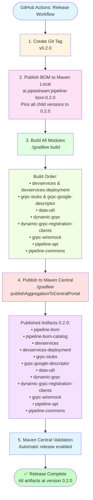

# Maven Central Release Flow

This diagram illustrates the complete release workflow for the platform-libraries release train.

## Workflow Steps Explained

### 1. Create Git Tag (v0.2.0)
- Triggered manually from GitHub UI with version selection
- Tag determines version for ALL modules via Axion Release plugin

### 2. Publish BOM to Maven Local
- **Critical step**: Makes `ai.pipestream:pipeline-bom:0.2.0` available locally
- BOM contains version constraints pinning all child modules to `${version}`
- Without this, child modules can't resolve the BOM during build

### 3. Build All Modules
- Runs `./gradlew build --no-daemon`
- All modules can now resolve `ai.pipestream:pipeline-bom:0.2.0` from Maven Local
- Build order (Gradle dependency resolution):
  1. **devservices** - Quarkus DevServices extension runtime
  2. **devservices-deployment** - Quarkus DevServices extension deployment
  3. **grpc-stubs** - Generated gRPC stubs with Mutiny support
  4. **grpc-google-descriptor** - gRPC descriptor with Google types
  5. **data-util** - Data utilities
  6. **dynamic-grpc** - Dynamic gRPC client support
  7. **dynamic-grpc-registration-clients** - Dynamic gRPC registration clients
  8. **grpc-wiremock** - gRPC WireMock integration
  9. **pipeline-api** - Shared API types and helpers
  10. **pipeline-commons** - Shared utilities

### 4. Publish to Maven Central
- Runs `./gradlew publishAggregationToCentralPortal --no-daemon`
- NMCP aggregation publishes all modules + BOM + catalog together
- GPG signs all artifacts
- Uploads to Maven Central Portal

### 5. Maven Central Validation
- Maven Central automatically validates all artifacts
- Checks POM metadata, signatures, sources, javadocs
- Auto-releases because `publishingType = "AUTOMATIC"`

## Key Design Points

- **Coordinated Release Train**: All modules share the same version number
- **BOM-First Strategy**: Publishing BOM to Maven Local first breaks circular dependency
- **Single Command**: `publishAggregationToCentralPortal` handles all 12 artifacts
- **Automatic Release**: No manual intervention needed in Maven Central UI
