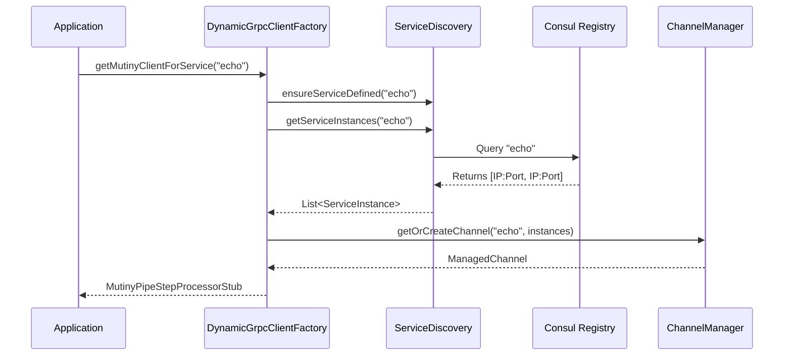
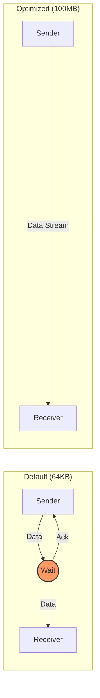

# Dynamic gRPC Library

The `platform-libraries/libraries/dynamic-grpc` module enables dynamic service discovery, efficient client creation, and high-performance gRPC communication for the Pipeline Engine. It bridges the gap between static gRPC definitions and the dynamic nature of the distributed pipeline architecture.

## Features

*   [**Dynamic Client Factory**](#dynamic-client-factory) - Create strongly-typed Mutiny gRPC clients on demand without static configuration.
*   [**Consul Service Discovery**](#consul-service-discovery) - Automatically discover service instances registered in Consul and load-balance requests.
*   [**Reflection-Based Stub Generation**](#reflection-based-stub-generation) - Generate any gRPC stub type dynamically at runtime.
*   [**Performance Optimization**](#performance-optimization) - Built-in tuning for HTTP/2 flow control to maximize throughput for large messages.

---

## Dynamic Client Factory

The `DynamicGrpcClientFactory` is the primary entry point. It abstracts away channel management, service discovery, and stub creation, allowing you to request a client for any service by name.

### Architecture Flow



### Usage

```java
@Inject
DynamicGrpcClientFactory grpcClientFactory; // (1)

public Uni<Void> callService(String serviceName, Request request) {
    return grpcClientFactory.getMutinyClientForService(serviceName) // (2)
        .chain(client -> client.processData(request)); // (3)
}
```

| Callout | Description |
| :--- | :--- |
| **(1)** | Inject the factory into your bean. It is `@ApplicationScoped`. |
| **(2)** | Request a client by its logical service name (e.g., "echo", "chunker"). The factory handles discovery and caching. |
| **(3)** | The returned object is a strongly-typed `MutinyStub` ready for reactive chaining. |

---

## Consul Service Discovery

The library integrates directly with Consul to find service instances, bypassing static Stork configuration for dynamic flexibility.

*   **Direct Integration:** Queries Consul for healthy instances of a named service.
*   **Load Balancing:** Implements a `RandomLoadBalancer` to distribute traffic among available instances.
*   **Stork Provider:** Acts as a custom Stork `NameResolverProvider` to feed discovered instances into the Quarkus/Stork ecosystem.

---

## Reflection-Based Stub Generation

The `GrpcClientProvider` uses Java reflection to instantiate Mutiny stubs. This allows the library to be generic and support *any* gRPC service definition found on the classpath without hardcoded dependencies.

### How it Works

```mermaid
graph TD
    A[GrpcClientProvider] -->|Input: Class&lt;T&gt;| B{Reflection Logic}
    B -->|1. Get Enclosing Class| C[MyServiceGrpc]
    B -->|2. Find Method| D[newMutinyStub(Channel)]
    B -->|3. Invoke| E[Stub Instance]
    E -->|Return| A
```

### Code Implementation

```java
// Internal generic method in GrpcClientProvider
private <T> T createStub(Class<T> stubClass, Channel channel) { // (1)
    Class<?> grpcClass = stubClass.getEnclosingClass(); // (2)
    Method newStubMethod = grpcClass.getMethod("newMutinyStub", Channel.class); // (3)
    return (T) newStubMethod.invoke(null, channel); // (4)
}
```

| Callout | Description |
| :--- | :--- |
| **(1)** | Takes the specific stub class type (e.g., `MutinyPipeStepProcessorStub`) and the active channel. |
| **(2)** | Identifies the parent gRPC class generated by `protoc`. |
| **(3)** | Reflectively finds the static factory method `newMutinyStub`. |
| **(4)** | Invokes the factory method to create the actual client instance. |

---

## Performance Optimization

Standard gRPC defaults (64KB flow control window) are insufficient for high-throughput systems processing large data chunks. This library automatically tunes both client and server settings.

### The Bottleneck



### Optimization Details

1.  **Client-Side:** `GrpcClientProvider` configures `NettyChannelBuilder` with an initial flow control window of **100MB** (configurable via `quarkus.grpc.clients."*".flow-control-window`).
2.  **Server-Side:** `GrpcServerFlowControlCustomizer` intercepts the server build process to apply the same 100MB window to the `NettyServerBuilder`.

### Configuration

```properties
# application.properties

# Enable separate server for Netty access (REQUIRED for server-side tuning)
quarkus.grpc.server.use-separate-server=true // (1)

# Tune Flow Control (Default: 100MB)
quarkus.grpc.server.flow-control-window=104857600 // (2)
quarkus.grpc.clients."*".flow-control-window=104857600 // (3)
```

| Callout | Description |
| :--- | :--- |
| **(1)** | **Crucial:** Must be `true`. The unified Vert.x server does not expose the necessary low-level Netty hooks. |
| **(2)** | Sets the server's reception window. |
| **(3)** | Sets the client's transmission window. |

See `GRPC_PERFORMANCE_OPTIMIZATION.md` for benchmark data showing throughput increases from ~10MB/s to ~350MB/s.